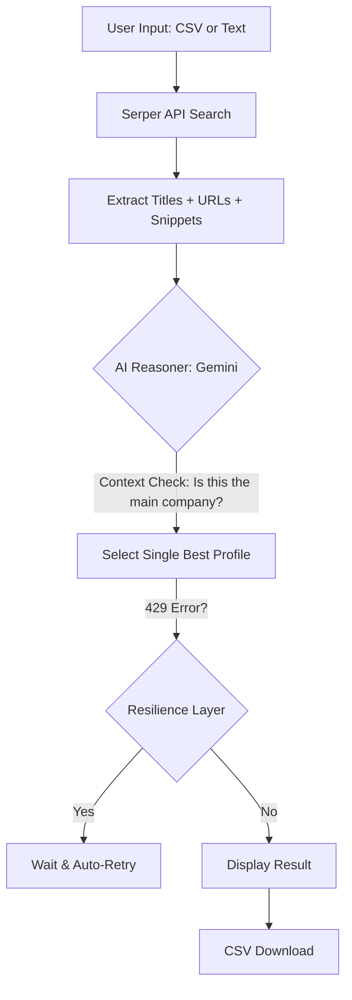

# 🔍 Intelligent LinkedIn Executive Scraper

This project automates executive research by extracting LinkedIn profiles of company leaders (CEO, Founder, etc.) using **Serper API** for context-rich search and **Google Gemini AI** for intelligent selection.

It features a modern **Streamlit UI** with built-in resilience and high-precision matching.

---

## 🚀 Intelligent Workflow



---

## 🛠️ Advanced Features
- **Context-Aware Precision**: Pulls search "snippets" to help the AI distinguish between primary companies and similarly named affiliates.
- **Resilience Layer**: Built-in exponential backoff to handle `429 RESOURCE_EXHAUSTED` (Rate Limit) errors automatically.
- **Dual Mode**: Process companies via bulk CSV upload or search for a single company instantly.
- **Modern SDK**: Fully migrated to the official `google-genai` library for stability and performance.
- **Smart Logic**: Prioritizes CURRENT roles and globally recognized leaders for famous entities.

---

## ⚙️ Setup & Usage

1. **Install Dependencies**:
   ```bash
   pip install -r requirements.txt
   ```

2. **Configure API Keys**:
   Create a `.env` file in the root directory:
   ```env
   SERPER_API_KEY=your_serper_key
   GEMINI_API_KEY=your_gemini_key
   ```

3. **Run the Application**:
   ```bash
   streamlit run app.py
   ```

---

## 🌐 Tech Stack
- **Frontend**: Streamlit
- **Search**: Serper.dev / Google Custom Search
- **AI**: Gemini 1.5/2.0 (via `google-genai`)
- **Resilience**: Custom automatic retry with backoff.

---

## 🤝 Project Structure
- `app.py`: The intelligent Streamlit web application.
- `kink2.py`: Original CLI script (legacy).
- `requirements.txt`: Project dependencies with the latest SDKs.
- `.env`: (Ignored) Your private API keys.
